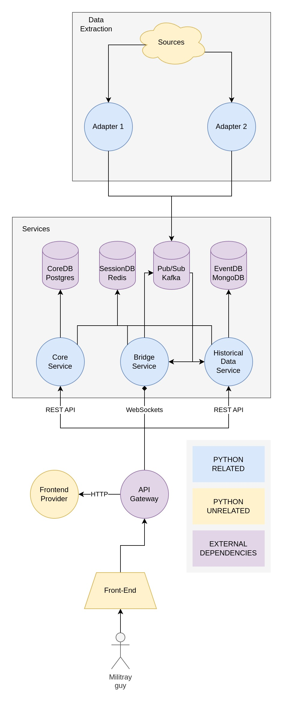
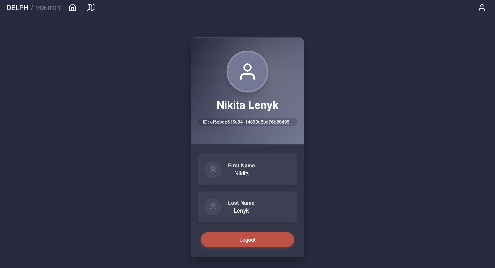
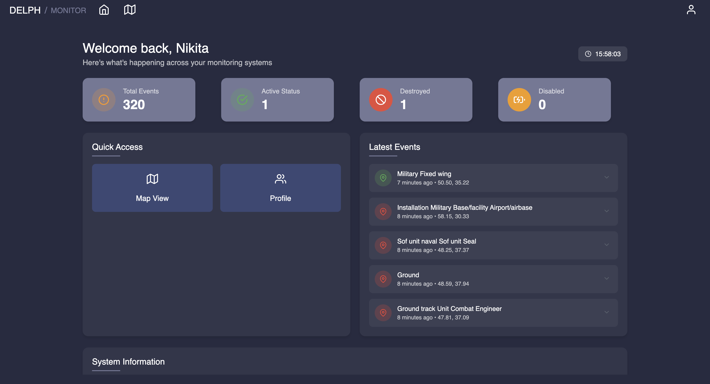

  

  <h1>Project Overview</h1>

DELPH - is a self-awareness platform. The main idea is to provide a realtime military event tracking activity across multiple theaters of operation. The platform integrates data from various sources to create a comprehensive situational awareness environment for military personnel and decision makers.

  

    
🌐 The website is currently available at <a href="https://delph.live" target="_blank">delph.live</a>

  

<h1 align="center">⚙️ Built with ⚙️</h1>

  <table border="0" cellspacing="0" cellpadding="0" style="border: none; border-collapse: separate; border-spacing: 10px 10px;">
    <tr>
      <td align="center" width="20%" style="padding: 20px; background-color: #f8f9fa; border-radius: 10px;">
        
         
        <b>Kafka</b>
      </td>
      <td align="center" width="20%" style="padding: 20px; background-color: #f8f9fa; border-radius: 10px;">
        
         
        <b>PostgreSQL</b>
      </td>
      <td align="center" width="20%" style="padding: 20px; background-color: #f8f9fa; border-radius: 10px;">
        
         
        <b>Nginx</b>
      </td>
      <td align="center" width="20%" style="padding: 20px; background-color: #f8f9fa; border-radius: 10px;">
        
         
        <b>Docker</b>
      </td>
    </tr>
    <tr>
      <td align="center" width="20%" style="padding: 20px; background-color: #f8f9fa; border-radius: 10px;">
        
         
        <b>FastAPI</b>
      </td>
      <td align="center" width="20%" style="padding: 20px; background-color: #f8f9fa; border-radius: 10px;">
        
         
        <b>MongoDB</b>
      </td>
      <td align="center" width="20%" style="padding: 20px; background-color: #f8f9fa; border-radius: 10px;">
        
         
        <b>Redis</b>
      </td>
      <td align="center" width="20%" style="padding: 20px; background-color: #f8f9fa; border-radius: 10px;">
        
         
        <b>React</b>
      </td>
    </tr>
  </table>

# Project Structure

DELPH operates as a distributed system with several interconnected components that work together to provide real-time military event tracking. Below is an overview of the system architecture and data flow:

## Architecture Overview

The system follows a microservices architecture with the following main components:

### Data Flow Pipeline

  

1. **Data Extraction Layer**:
   - Multiple data sources are integrated through specialized adapters
   - Adapters transform source-specific data into a standardized format
   - Data is then published to Kafka for distribution

2. **Core Services**:
   - **Bridge Service**: Handles real-time event streaming via WebSockets
   - **Historical Data Service**: Stores and retrieves past events
   - **Core Service**: Manages authentication, user sessions, and access control

3. **Storage Layer**:
   - **PostgreSQL (CoreDB)**: Stores user data and system configuration
   - **Redis (SessionDB)**: Manages active sessions and temporary data
   - **Kafka (Pub/Sub)**: Facilitates real-time message streaming
   - **MongoDB (EventDB)**: Archives historical event data for querying

4. **Delivery Layer**:
   - **API Gateway (Nginx)**: Routes requests to appropriate services
   - **Frontend**: React-based user interface displaying event data

## Event Processing Flow

1. Events are generated from various sources (e.g., mock producers, external systems)
2. Events flow through adapters that normalize the data
3. Standardized events are published to Kafka topics
4. The Bridge service consumes events and:
   - Forwards real-time updates to connected clients via WebSockets
   - Stores events to MongoDB for historical record
5. Clients receive updates through WebSocket connections
6. Historical data can be queried via REST APIs from the Historical Data Service

## Military Entity Representation

The system uses standardized military symbology based on APP-6B specifications to represent various entities:
- Ground units (infantry, armored, artillery, etc.)
- Air assets (fixed wing, rotary wing, drones)
- Naval vessels
- Special operations forces
- Equipment and installations

### NATO APP-6B Military Symbology
| Dimension | Friendly | Hostile | Neutral | Unknown |
|-----------|---------|---------|---------|---------|
| Air and space |  |  |  |  |
| Ground |  |  |  |  |
| Sea surface |  |  |  |  |
| Subsurface |  |  |  |  |

## Application Screenshots

### Historical Data View with Time Filtering

  
  
The historical view allows filtering events by time period and entity types, showing past military activities across the map

### User Profile Interface

  
  
Secure user authentication system with profile management capabilities and role-based access control

### Real-time Operational Map

  
  
Live visualization of military entities using NATO APP-6B symbology
  

### Dashboard Overview

  
  
Command dashboard providing at-a-glance status of current operations, event statistics, and recent activity feeds

## Our Team

  <table border="0" cellspacing="0" cellpadding="0" style="border: none; border-collapse: separate; border-spacing: 15px 15px; margin-bottom: 20px;">
    <tr>
      <td align="center" width="25%" style="padding: 15px; background-color: #f8f9fa; border-radius: 10px;">
        <a href="https://github.com/draklowell" target="_blank">
          
           
          <b>@draklowell</b>
        </a>
        
Bridge Service Lead

        
Real-time data streaming implementation and WebSocket communication

      </td>
      <td align="center" width="25%" style="padding: 15px; background-color: #f8f9fa; border-radius: 10px;">
        <a href="https://github.com/ke1rro" target="_blank">
          
           
          <b>@ke1rro</b>
        </a>
        
API & Frontend Lead

        
REST API development and React-based user interface implementation

      </td>
    </tr>
    <tr>
      <td align="center" width="25%" style="padding: 15px; background-color: #f8f9fa; border-radius: 10px;">
        <a href="https://github.com/Luzefik" target="_blank">
          
           
          <b>@Luzefik</b>
        </a>
        
Historical Data Service

        
Event archiving and historical query system development

      </td>
      <td align="center" width="25%" style="padding: 15px; background-color: #f8f9fa; border-radius: 10px;">
        <a href="https://github.com/yagodanr" target="_blank">
          
           
          <b>@yagodanr</b>
        </a>
        
Historical Data Service

        
Database optimization and filtering system implementation

      </td>
    </tr>
  </table>

## References & Inspiration

  
<strong>Delta Platform</strong> is a situational awareness and battlefield management system developed by the Ukrainian military services. Our project draws inspiration from this system's approach to real-time military event tracking and visualization using standardized NATO symbology.

  
The original Delta platform enables Ukrainian forces to maintain comprehensive battlefield awareness through multi-source data integration and collaborative information sharing. It has proven highly effective in modern military operations by providing commanders with accurate, real-time intelligence.

  

    <a href="https://delta.mil.gov.ua/" target="_blank" style="display: inline-block; margin-top: 15px; padding: 10px 20px; background-color: #5073d5; color: white; text-decoration: none; border-radius: 30px; font-weight: bold;">Official Delta Website</a>
  

  
References:

  <ol style="font-size: 0.9em;">
    <li>Ministry of Defense of Ukraine, "Delta Situational Awareness System", <a href="https://delta.mil.gov.ua/" target="_blank">https://delta.mil.gov.ua/</a>, accessed 2023.</li>
    <li>NATO, "APP-6 Military Symbols for Land Based Systems", NATO Standardization Agency, 2019.</li>
  </ol>

